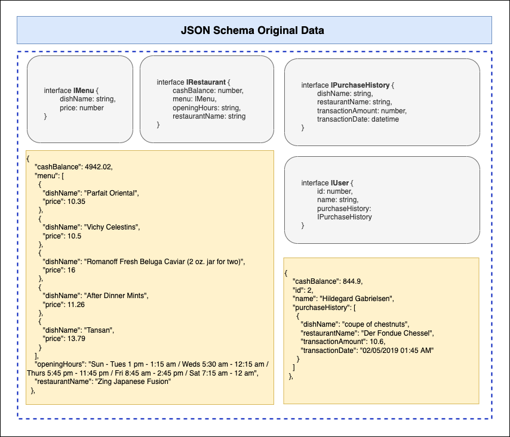

# Requirements & ETL Process for Source Data

##Table of Content

- [Requirements](#requirements)
- [Source Data](#source-data)
- [ERD](#erd)
- [JSON Schema Transformation](#json-schema-transformation)
- [Data Transformation](#data-transformation)
  - [Detail Transformation Process](#detail-transformation-process)
  - [Working Hours Data Transformation](#working-hours-data-transformation)

## Requirements

The operations the front-end team would need to be supported are:

1. List all restaurants that are open at a certain datetime
2. List top y restaurants that have more or less than x number of dishes within a price range, ranked alphabetically
3. Search for restaurants or dishes by name, ranked by relevance to search term
4. Process a user purchasing a dish from a restaurant, handling all relevant data changes in an atomic transaction. Do watch out for potential race conditions that can arise from concurrent transactions!

## Source Data

- Restaurants Data

```json
{
  "cashBalance": 2614.96,
  "menu": [
      {
          "dishName": "Rasher of Bacon served with Broiled Meats",
          "price": 12.93
      },
      {
          "dishName": "Ugnstekt Apple",
          "price": 10.43
      },

  ],
  "openingHours": "Mon, Weds 5:15 am - 8:30 pm / Tues, Sat 1:30 pm - 3:45 pm / Thurs 7:45 am - 8:15 am / Fri 1:30 pm - 7 pm / Sun 12:45 pm - 6:15 pm",
  "restaurantName": "12 Baltimore"
},
```

- Users Data

```json
{
  "cashBalance": 844.9,
  "id": 2,
  "name": "Hildegard Gabrielsen",
  "purchaseHistory": [
      {
          "dishName": "coupe of chestnuts",
          "restaurantName": "Der Fondue Chessel",
          "transactionAmount": 10.6,
          "transactionDate": "02/05/2019 01:45 AM"
      }
  ]
},
```

## ERD

Based on the given requirements and sample data, I came up with the simple ERD design shown below. There are six tables in total:

- `Restaurant`: Storing the restaurant data and its cash balance info.
- `Menu`: Storing menu name. One thing to note that, a menu can be served at several restaurant at different price.
- `RestaurantMenu`: An intermediary table that connect the Restaurant and Menu tables.
- `WorkingHours`: The working hours for each restaurant.
- `RestoBalanceSheet`: Basically a table that store any change to a restaurant balance sheet due to customer's purchase.
- `User`: Table to store user informations.
- `UserBalanceSheet`: Table that keep history any change to users' balance sheet related to any purchase transactions they made.


## JSON Schema Transformation

To easily understood the data, JSON schemas are created for the original and the transformed data. The transformed data basically is mapping how the ERDs for this service are designed before.

The transformed schema can also help to keeping track of how the data should look like after the transformation is done and can be easily used to seed the database later.

Below are the two schemas diagram:

- JSON Schema Original Data



<br>

- JSON Schema Transformed Data


## Data Transformation

### Detail Transformation Process

The transformation process can be divided into several small process. Each processes will then be handled by a small transformation function module. Each has a specific uses and their functionalities can be tested easily.

Basically, the data transformation process will look like something in the image below.
<br>


<br>
The transformation process itself can be understood as follows:

- First, restaurant data will be transformed into four different kind of data.
  - **`Restaurant`**: Detail data for each restaurant.
  - **`Menu`**: Detail distinct menu that are available in one or more restaurant.
  - **`RestaurantMenu`**: Data object that maps `Restaurant` with `Menu` data.
  - **`WorkingHours`**: Restaurant opening & closing hours data.
- Second, the User data will use `RestaurantMenu` data and get transformed into two objects:
  - **`User`**: Detail user data.
  - **`PurchaseHistory`**: Data object thank links `RestaurantMenu` with `User` data.

### Working Hours Data Transformation

There are definitely several methods that can be used to store the working hours information. But for the sake of simplicity, this project will follow this convetions (for now):

**Working Hours**

- The 24-hours system will be used. Therefore, all working hours will be converted from 12-hours to 24-hours.
- Timezones will not be considered for now.
- The opening and closing hours will be stored as number of minutes past midnight. The method of storage is chosen because, storing & especially range-querying of an integer numbers are a lot more easier compared to string.
- An example of working hour is `01:30AM`. After the transformation, this hour will be equivalent to `90` minutes past midnight.

**Working Days**

- The working day parameter will also be stored as an integer for easy query.
- For example, a Monday can be represented as `1` and Sunday is `7`

<hr>

Copyright © Muhammad Arifin (2022)
